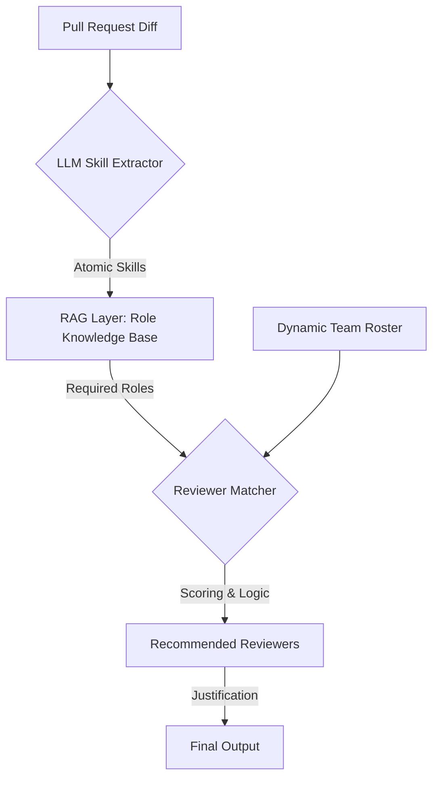

# AI-Powered Pull Request Reviewer Recommendation System

This system automates the selection of pull request reviewers by bridging the gap between raw code changes and human expertise using a multi-stage LLM and RAG pipeline. It identifies what skills are needed, which roles those skills belong to, and which team members are the best fit.

---

## 🔄 System Architecture

The system follows a decoupled pipeline to ensure that technical requirements are mapped to organizational roles before assigning specific individuals.



---

## 📋 Process Flow

### 1. Skill Extraction (The "What")

The system ingests the raw `git diff` and PR metadata. An LLM analyzes the code changes to identify specific technical competencies required to safely review the code.

* **Input:** PR Title, Description, and File Diffs.
* **Output:** A weighted list of technical skills (e.g., `React Hooks`, `PostgreSQL Migrations`, `JWT Auth`).

### 2. Role Mapping via RAG (The "Who Type")

To ensure architectural alignment, the system uses **Retrieval-Augmented Generation (RAG)** to map extracted skills to defined organizational roles.

* **Knowledge Base:** A vector database containing "Role Personas" (e.g., Database Administrator, Security Engineer, Frontend Lead).
* **Mechanism:** The system queries the Vector DB using the extracted skills to find the most relevant roles.
* **Benefit:** Decouples technical tasks from individual people, making the system adaptable to changing team structures.

### 3. Candidate Matching (The "Who Specifically")

Once the required roles are identified, the system cross-references them against the **Dynamic Team Roster** (the current project members).

* **Filtering:** Narrow down the team to individuals currently assigned to the identified roles.
* **Ranking:** Candidates are ranked based on a composite score:
* **Skill Match:** Proficiency in the atomic skills identified in Step 1.
* **Contextual Recency:** Historical activity in the specific files or modules being changed.
* **Workload:** Current number of open PRs assigned to prevent bottlenecks.


### 4. Recommendation & Justification

The final output provides a list of suggested reviewers accompanied by a "Reasoning" string generated by the LLM.

* **Example:** *"Suggested @user123 (Senior Backend) because they have 90% skill overlap with the new Redis implementation and recently modified the Auth module."*

---

## 📂 Knowledge Base Structure (RAG)

The Role Knowledge Base consists of structured personas used for vector similarity search. Example entry:

```json
{
  "Role: Machine Learning Engineer | Details: Python Programming Language SQL Machine Learning Deep Learning Natural Language Processing NLP Data Analytics Machine Learning Algorithms TensorFlow Keras github                                           Bachelor of Technology (B.Tech.), Computer Science GITAM Deemed University     ML Engineer Tata Consultancy Services"

}

```

---

## 🛠 Tech Stack

* **LLM:** Gemini 1.5 Pro / GPT-4o
* **Vector DB:** ChromaDB (for Role Knowledge Base)
* **Framework:** LangChain / LlamaIndex
* **API:** GitHub GraphQL API

```
