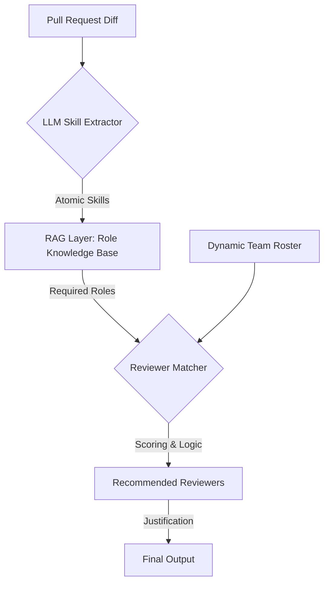

# AI-Powered Pull Request Reviewer Recommendation System

This system automates the selection of pull request reviewers by bridging the gap between raw code changes and human expertise using a multi-stage LLM and RAG pipeline. It identifies what skills are needed, which roles those skills belong to, and which team members are the best fit.

---

## 🔄 System Architecture

The system follows a decoupled pipeline to ensure that technical requirements are mapped to organizational roles before assigning specific individuals.



---

## 📋 Process Flow

### 1. Skill Extraction (The "What")

The system ingests the raw `git diff` and PR metadata. An LLM analyzes the code changes to identify specific technical competencies required to safely review the code.

* **Input:** PR Title, Description, and File Diffs.
* **Output:** A weighted list of technical skills (e.g., `React Hooks`, `PostgreSQL Migrations`, `JWT Auth`).

### 2. Role Mapping via RAG (The "Who Type")

To ensure architectural alignment, the system uses **Retrieval-Augmented Generation (RAG)** to map extracted skills to defined organizational roles.

* **Knowledge Base:** A vector database containing "Role Personas" (e.g., Database Administrator, Security Engineer, Frontend Lead).
* **Mechanism:** The system queries the Vector DB using the extracted skills to find the most relevant roles.
* **Benefit:** Decouples technical tasks from individual people, making the system adaptable to changing team structures.

### 3. Candidate Matching (The "Who Specifically")

Once the required roles are identified, the system cross-references them against the **Dynamic Team Roster** (the current project members).

* **Filtering:** Narrow down the team to individuals currently assigned to the identified roles.
* **Ranking:** Candidates are ranked based on a composite score:
* **Skill Match:** Proficiency in the atomic skills identified in Step 1.
* **Contextual Recency:** Historical activity in the specific files or modules being changed.
* **Workload:** Current number of open PRs assigned to prevent bottlenecks.


### 4. Recommendation & Justification

The final output provides a list of suggested reviewers accompanied by a "Reasoning" string generated by the LLM.

* **Example:** *"Suggested @user123 (Senior Backend) because they have 90% skill overlap with the new Redis implementation and recently modified the Auth module."*

---

## API Contract (v2)

The system exposes a versioned endpoint for frontend and .NET integration:

- **Method:** `POST`
- **Path:** `/api/recommend/v2`
- **Purpose:** Return reviewer recommendations with required-reviewer handling and configurable ranking weights.

### Request Parameters

```json
{
  "owner": "huggingface",
  "repo": "transformers",
  "pr_number": 44935,
  "required_reviewers": ["lvliang-intel", "someone-new"],
  "options": {
    "top_k": 5,
    "prioritize_recent_activity": true,
    "commits_per_reviewer": 50
  }
}
```

- `owner`: GitHub organization/user that owns the repository.
- `repo`: Repository name under `owner`.
- `pr_number`: Pull request number in that repository.
- `required_reviewers`: Optional. Frontend-provided usernames that must be evaluated explicitly.
- `options`: Optional object. If omitted, server defaults are used.
- `options.top_k`: Optional override. Default is `5`.
- `options.prioritize_recent_activity`: Optional override. Default is `true` (favor recent commit activity).
- `options.commits_per_reviewer`: Optional override. Default is `50` recent commits per reviewer.

### Ranking Behavior

- The ranking always considers skill match.
- When `prioritize_recent_activity=true`, recent activity is blended into preliminary ranking to favor currently active contributors.
- Commit recency is computed from the most recent `commits_per_reviewer` commits per candidate.
- By default, all detected candidate contributors are analyzed; options only customize behavior when provided.
- Required reviewers receive explicit evaluation output even when they are not included in final recommendations.

### Contributor-Only Policy

- Recommended reviewers must be contributors of the target repository.
- A required reviewer who is not a repository contributor is returned as:
  - `included: false`
  - `reasons: ["required_reviewer_not_repo_contributor"]`

### Response Shape

```json
{
  "required_reviewers_result": [
    {
      "name": "lvliang-intel",
      "included": true,
      "confidence_score": 65,
      "justification": "...",
      "reasons": ["required_reviewer", "recent_activity_priority"]
    },
    {
      "name": "someone-new",
      "included": false,
      "confidence_score": 0,
      "justification": "Reviewer was required by frontend but is not a contributor of this repository.",
      "reasons": ["required_reviewer_not_repo_contributor"]
    }
  ],
  "recommended_reviewers": [
    {
      "name": "candidate-a",
      "confidence_score": 72,
      "justification": "...",
      "reasons": ["strong_skill_match"],
      "required_reviewer": false,
      "score_breakdown": {
        "skill_score": 0.8,
        "recency_score": 0.4,
        "preliminary_score": 0.67,
        "ai_score": 0.71,
        "prioritize_recent_activity": true,
        "commits_considered_per_reviewer": 50
      }
    }
  ],
  "diagnostics": {
    "candidate_pool_size": 42,
    "required_reviewers_requested": 2,
    "prioritize_recent_activity": true,
    "commits_per_reviewer": 50,
    "indexed_commit_window": 1000
  }
}
```

---

## 📂 Knowledge Base Structure (RAG)

The Role Knowledge Base consists of structured personas used for vector similarity search. Example entry:

```json
{
  "Role: Machine Learning Engineer | Details: Python Programming Language SQL Machine Learning Deep Learning Natural Language Processing NLP Data Analytics Machine Learning Algorithms TensorFlow Keras github                                           Bachelor of Technology (B.Tech.), Computer Science GITAM Deemed University     ML Engineer Tata Consultancy Services"

}

```

---

## 🛠 Tech Stack

* **LLM:** Groq (primary) with Gemini fallback support
* **Vector DB:** ChromaDB (for Role Knowledge Base)
* **Framework:** LangChain / LlamaIndex / Pre-defined AI Clean Code Frameworks
* **API:** GitHub GraphQL API, .NET Jira Backend

### LLM Provider Configuration

The system now supports provider routing through the centralized LLM wrapper.

Recommended default mode:

```env
LLM_PROVIDER=groq_primary_gemini_fallback
GROQ_API_KEY=your_groq_key
GROQ_MODEL_PRIMARY=llama-3.3-70b-versatile
GROQ_MODEL_FALLBACKS=llama-3.1-8b-instant

GEMINI_API_KEY=your_gemini_key
LLM_MODEL_PRIMARY=gemini-3.1-flash-lite-preview
LLM_MODEL_FALLBACKS=gemini-1.5-flash
```

Supported provider modes:

- `groq_primary_gemini_fallback` (recommended)
- `gemini_primary_groq_fallback`
- `groq_only`
- `gemini_only`

Purpose-specific model overrides are supported with either generic keys or provider-specific keys:

- Generic: `LLM_MODELS_PR_SKILL_EXTRACTION=model-a,model-b`
- Provider-specific: `LLM_MODELS_GROQ_PR_SKILL_EXTRACTION=model-a,model-b`

All existing agents continue to call the same `generate_with_resilience` wrapper, so no endpoint contract or business-logic changes are required.

---

## 🚀 Multi-Agent Evolution (v2) & Jira Integration

To address input-size limitations and enhance tracking accuracy, the recommendation pipeline has been evolved into a **Stateful Multi-Agent Workflow**, adhering to AI Clean Code standards.

### The "Story" of the New Changes (How to Explain It)

The core challenge was that evaluating every developer's massive git commit history using an LLM directly would result in excessive context limits. 
Therefore, we separated the capabilities into isolated "Automated Agents" orchestrating together:

1. **The PR Agent** (`extract_pr_skills`): Extracts the required languages and atomic skills from the incoming PR.
2. **The Jira Analyzer Agent** (`jira_agent.py`): Reaches out to the configured `.NET` REST API to fetch a developer's recently assigned Jira tickets. It uses the LLM to deduce what domain (e.g., UI, Database, Auth) the developer is focusing on *right now*.
3. **The Matchmaker / Scorer Agent** (`scorer_agent.py`): Acts as the "Tech Lead". It intakes the PR constraints, the Vector DB recommendations (RAG), and the summarized Jira/commit history, generating a scaled **0-100 Confidence Score** with human-readable rationale.

### Component Code Explanations (Line-by-Line Concepts)

#### 1. `Engine_test.py` (The Orchestrator)
**What it does:** It's the central pipeline that ties everything together.
**Line-by-line Breakdown:**
- It calls the PR Agent (`extract_pr_skills`) to find out the requirements.
- It calls `search_vector_db` to get historical role guidance from RAG.
- **The Filter (Crucial Optimization):** Instead of hitting the Jira API and LLM for all 100 historical contributors computationally, it uses a fast mathematical formula `len(matched_skills) / max(req_languages)` to filter the pool down to the **Top 10 Preliminary Candidates**.
- For those 10, it launches `analyze_jira_context` to fetch Jira domains.
- Finally, it aggregates all parameters and triggers the Scorer Agent (`calculate_match_scores`) to assign the final `confidence_score`.

#### 2. `jira_agent.py` (The Context Gatherer)
**What it does:** Maps a username to their current workload focus.
**Line-by-line Breakdown:**
- Uses the `requests` library to fetch JSON payloads from the `JIRA_API_BASE_URL` (the internal .NET backend).
- Loops through up to 10 recent tickets, merging their titles and descriptions into a singular text block.
- Invokes the LLM by formatting variables into the isolated `JIRA_ANALYSIS_PROMPT`.
- **Clean Code Mechanics:** To enforce structural integrity, it uses `Pydantic (BaseModel)` so the JSON response structurally maps strictly to `{"domain", "recent_skills", "summary"}`. It implements a deterministic `3-max-retries` loop (`json.JSONDecodeError` and `ValidationError` capture) for resilience against hallucinated JSON architectures.

#### 3. `scorer_agent.py` (The Final Matchmaker)
**What it does:** Eliminates naive language matching by adding smart, contextual semantic AI evaluation.
**Line-by-line Breakdown:**
- Combines the `pr_skills`, the vector database `rag_context`, and loops through mapping out each candidate's raw `commits` + current `Jira Domain`.
- Invokes the LLM using the externalized `SCORER_PROMPT`.
- Parses the string into a JSON array, structurally validating it into `[CandidateScore]` (which enforces the `{name, confidence_score, justification}` structure).
- Sorts the Array descending by score. **Graceful Degradation:** If the LLM throws an exception 3 times in a row, a pure mathematical fallback score logic is immediately executed, guaranteeing the system never crashes.

#### 4. `prompts.py` (AI Clean Code Configurations)
**What it does:** Extracts hardcoded AI instructions away from pure business logic.
**The Concept:** By placing `JIRA_ANALYSIS_PROMPT` and `SCORER_PROMPT` here as top-level variables, they become 'first-class configuration items'. This prevents Python execution logic from being visually polluted by massive strings, allows the team to tweak the LLM constraints easily without introducing python bugs, and strictly enforces **Separation of Concerns**.

