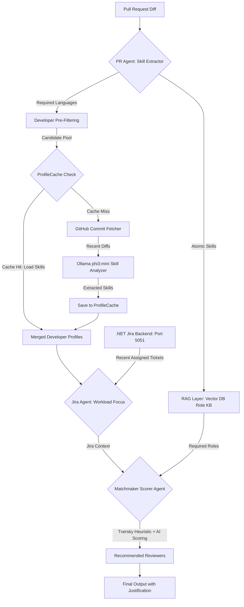

# AI-Powered Pull Request Reviewer Recommendation System

This system automates the selection of pull request reviewers by bridging the gap between raw code changes and human expertise using a multi-stage LLM and RAG pipeline. It identifies what skills are needed, which roles those skills belong to, and which team members are the best fit.

---

## 🔄 System Architecture (Smart Caching Architecture)

The evolved system leverages a multi-agent, caching-aware workflow designed to maximize accuracy, eliminate local LLM bottlenecks, and drastically reduce redundant LLM calls.



---

## 📋 Process Flow

### 1. Skill Extraction (The "What")
The system ingests the raw `git diff` and PR metadata. An LLM analyzes the code changes to identify specific technical competencies required to safely review the code.
* **Input:** PR Title, Description, and File Diffs.
* **Output:** A weighted list of technical skills (e.g., `React Hooks`, `PostgreSQL Migrations`, `JWT Auth`).

### 2. Role Mapping via RAG (The "Who Type")
To ensure architectural alignment, the system uses **Retrieval-Augmented Generation (RAG)** to map extracted skills to defined organizational roles.
* **Knowledge Base:** A vector database containing "Role Personas" (e.g., Database Administrator, Security Engineer, Frontend Lead).
* **Mechanism:** The system queries the Vector DB using the extracted skills to find the most relevant roles.

### 3. Smart Skill Caching & Commit Fetching (The Optimization)
To avoid evaluating every developer's massive git commit history using the LLM directly (which causes token/memory bottlenecks and API cost issues):
1. **GitHub Commit Fetcher:** Fetches actual commit history dynamically for candidate developers.
2. **Profile Cache (`ProfileCache`):** The system checks if the candidate's skills are already profiled in a local JSON cache.
   - **Cache Hit:** Directly loads the developer's historical skills from the cache (0 LLM calls made!).
   - **Cache Miss:** Runs the local Ollama LLM (`phi3:mini`) only on the newly fetched commits to deduce skills, then saves them to the cache for future requests.

### 4. Jira Context Analysis (The "Workload Focus")
To avoid assigning reviews to developers focused on completely different tasks, the **Jira Agent** reaches out to the configured `.NET` REST API (`localhost:5051` or custom base URL) to fetch the candidate's recently assigned Jira tickets. It uses the LLM to summarize their active domains of focus *right now*.

### 5. Matchmaker & Scoring (The "Who Specifically")
The **Matchmaker / Scorer Agent** acts as the "Tech Lead." It blends the following metrics into a **0-100 Confidence Score**:
* **Tversky Similarity Index:** A high-speed file path overlap match comparing files changed in the PR to candidate commit history.
* **Skill Alignment:** Matching cache/LLM skills and active Jira contexts against Vector DB roles.
* **Fallback Mode:** If LLM scoring experiences an error, a robust pure mathematical fallback is triggered to prevent the service from failing.

---

## 🔌 API Contracts

The system exposes two versioned endpoints for frontend and .NET orchestrator integration.

### 1. `/api/recommend/v2`

* **Method:** `POST`
* **Purpose:** Returns customized reviewer recommendations with support for explicit candidate profiles.

#### Request Shape
```json
{
  "owner": "MalakHisham121",
  "repo": "codience-test",
  "pr_number": 1,
  "required_reviewers": [
    {
      "username": "MalakHisham121",
      "jira_username": "Malak Hesham",
      "raw_skills": ["python", "react", "fastapi"]
    }
  ],
  "options": {
    "top_k": 5,
    "prioritize_recent_activity": true,
    "commits_per_reviewer": 50
  },
  "jira_token": "YOUR_JIRA_ACCESS_TOKEN",
  "jira_cloud_id": "7cb11454-7b11-4eed-a345-54b06f4ce1f7",
  "jira_project_key": "SCRUM"
}
```

* `required_reviewers`: List of strings or dicts. Dict entities can provide a custom `jira_username` and `raw_skills` override.
* `options.top_k`: Number of recommendations to return (Default: 5).
* `options.prioritize_recent_activity`: Favor recent commit activity (Default: `true`).

#### Response Shape
```json
{
  "recommended_reviewers": [
    {
      "name": "MalakHisham121",
      "confidence_score": 92,
      "justification": "Has explicit Python skills and high file-path similarity, but lacks specific commit history or Jira context for advanced Python idioms..."
    }
  ]
}
```

---

### 2. `/api/orchestrator`

* **Method:** `POST`
* **Purpose:** Orchestrates profiling and scoring across a specified list of fully detailed user entities (highly useful when developers are managed dynamically outside of local VCS indexing).

#### Request Shape
```json
{
  "owner": "MalakHisham121",
  "repo": "codience-test",
  "pr_number": 1,
  "users": [
    {
      "github_username": "MalakHisham121",
      "jira_username": "Malak Hesham",
      "jira_token": "YOUR_JIRA_ACCESS_TOKEN",
      "jira_cloud_id": "7cb11454-7b11-4eed-a345-54b06f4ce1f7",
      "jira_project_key": "SCRUM",
      "raw_skills": ["python", "react", "fastapi"]
    }
  ],
  "commits_per_user": 50,
  "options": {
    "top_k": 5,
    "prioritize_recent_activity": true
  }
}
```

#### Response Shape
```json
{
  "recommended_reviewers": [
    {
      "name": "MalakHisham121",
      "confidence_score": 92,
      "justification": "Matched based on raw_skills override and dynamic profiling..."
    }
  ]
}
```

---

## 📂 Active Module Structure (`/PRNew/`)

The core engine is structured into clean, modular, and decoupled Python services under the `codience/src/Reviewer_Recommender/PRNew/` package:

### 1. `Reviewer_Engine.py` (The Orchestrator)
The central workflow coordinator. It orchestrates the indexing of repository contributors, checks the local profile cache, calls the GitHub and Jira services, and delegates scoring. It enforces an intelligent **Top 10 Preliminary Pre-Filter** to ensure that local LLM tokens are conserved.

### 2. `profile_cache.py` (The Caching Layer)
Implements a filesystem-based JSON caching architecture for developer skill profiles. It manages loading, updating, and saving developer capabilities to eliminate redundant LLM executions entirely.

### 3. `commit_history_utils.py` ( Vcs Client)
Handles GitHub API calls to fetch commit logs. It extracts file paths, changes, and commits, and maps commits to raw developer activities to supply data to the Tversky formula.

### 4. `jira_agent.py` (.NET Workload Bridge)
Interfaces with the custom `.NET` JiraController API (`/api/Jira/assigned-tickets`) to pull live assigned Jira tickets for developers, utilizing isolated LLM prompts to summarize what they are actively working on.

### 5. `scorer_agent.py` (The Matchmaker)
Intakes PR requirements, developer skills, commit metrics, and Jira contexts. It formats them into a strict AI prompt to evaluate confidence scores and output human-readable justifications, backed by a robust math-scoring fallback system.

### 6. `prompts.py` (System Prompts)
Isolates hardcoded LLM prompts from business logic, making it easy to tune LLM behavior without editing Python code files.

---

## 🛠 Tech Stack & Environment Settings

* **VCS Client:** GitHub REST API v3
* **Primary LLMs:** Groq (`llama-3.3-70b-versatile`) with Gemini fallback support.
* **Local LLM:** Ollama (`phi3:mini`) for developer skill profiling.
* **Vector DB:** ChromaDB (stores organizational role personas).
* **Jira Integration Backend:** REST API hosted on custom `.NET` server (`port 5051`).
